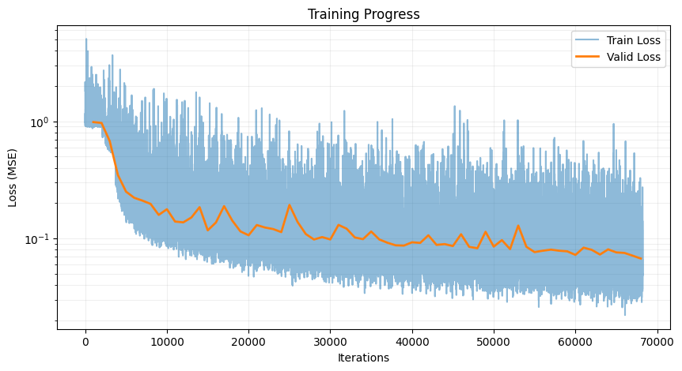
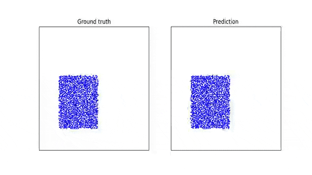
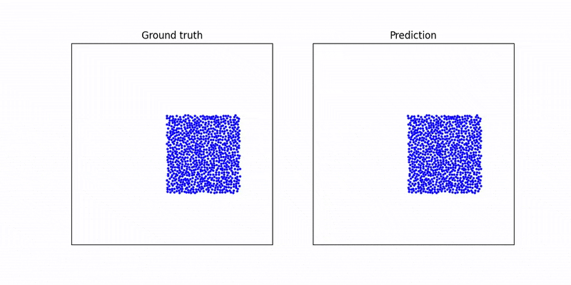
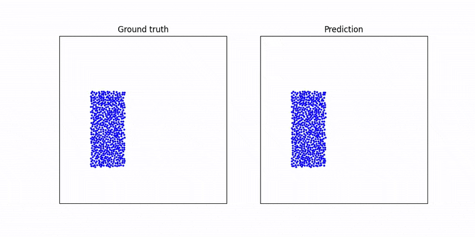

# LTSimulation: Learning to Simulate Complex Physics with Graph Networks

This repository contains an end-to-end implementation of a **graph neural network (GNN)**–based physics simulator, developed and documented in the accompanying Jupyter Notebook. The project follows the *Learning to Simulate* paradigm, where physical systems are modeled as graphs and future dynamics are predicted by message passing rather than explicit numerical solvers.

The focus is on **learning particle-based dynamics** directly from data and demonstrating that graph networks can accurately generalize to complex physical interactions.

---

## Project Overview

Physical systems such as fluids, deformable materials, or interacting particles can be naturally represented as graphs:

* **Nodes** represent particles or material points
* **Edges** represent interactions (e.g., proximity, forces)
* **Node features** encode state variables such as position and velocity

In this project:

* A graph-based simulator is trained to predict **future particle states**
* Training and validation loss curves are used to assess convergence
* The trained model is evaluated qualitatively via rollout simulations

---

## Methodology

The pipeline implemented in the notebook follows these steps:

1. **Dataset Preparation**

   * Physical trajectories are converted into graph-structured data
   * Each timestep is represented as a graph with node and edge features

2. **Graph Construction**

   * Neighborhoods are defined based on spatial proximity
   * Edge features encode relative positions and distances

3. **Model Architecture**

   * A message-passing Graph Neural Network
   * Node and edge update functions implemented as MLPs
   * Multiple message-passing steps per rollout

4. **Training**

   * Supervised learning using next-step prediction
   * Mean Squared Error (MSE) loss
   * Separate training and validation splits

5. **Evaluation and Rollout**

   * Single-step validation loss tracking
   * Multi-step rollout to test stability and physical realism

---

## Results

The model was trained for approximately 8 hours on a single NVIDIA T4 GPU. Training exhibited stable convergence, with validation loss decreasing smoothly and no signs of divergence or overfitting.

Qualitative evaluation was performed using multi-step rollouts on unseen validation scenarios. As shown in the rollout visualizations, the learned simulator is able to:

* Maintain stable long-horizon dynamics

* Preserve coherent particle interactions

* Avoid error accumulation and physical drift over time

Despite being trained with a one-step prediction objective, the model generalizes effectively to long rollouts, producing physically plausible trajectories across different initial conditions. These results are consistent with prior findings in graph-network-based physical simulation and demonstrate that the learned interaction model captures the underlying dynamics rather than merely memorizing short-term behavior.

The training process shows stable convergence, with validation loss decreasing smoothly over epochs.

<p align="center">
  
  
</p>

These plots demonstrate that the model generalizes beyond the training data and avoids overfitting.

### Rollout Simulation

The following GIFs show qualitative rollouts produced by the trained graph network. Each rollout corresponds to an unseen validation scenario and demonstrates that the learned dynamics remain coherent over multiple timesteps without divergence.

<p align="center">
  
  
  
</p>

---

## Requirements

The notebook relies on standard scientific Python and deep learning libraries:

* Python 3.10 (minimum)
* NumPy < 2
* PyTorch 2.2.0 + cu121
* PyTorch Geometric (or equivalent graph utilities)
* Matplotlib
* tqdm

Exact versions can be adapted depending on the execution environment.

---

## Key References and Background

This project is inspired by and closely follows prior work on graph-based physical simulation:

* Sanchez-Gonzalez et al., *Learning to Simulate Complex Physics with Graph Networks*, ICML 2020
* Battaglia et al., *Interaction Networks for Learning about Objects, Relations and Physics*, NeurIPS 2016
* Stanford CS224W Blog: *Simulating Complex Physics with Graph Networks – Step by Step*

### BibTeX Citation

```
@inproceedings{sanchezgonzalez2020learning,
  title={Learning to Simulate Complex Physics with Graph Networks},
  author={Alvaro Sanchez-Gonzalez and
          Jonathan Godwin and
          Tobias Pfaff and
          Rex Ying and
          Jure Leskovec and
          Peter W. Battaglia},
  booktitle={International Conference on Machine Learning},
  year={2020}
}
```

---

## Notes

* This project is intended for educational and research purposes
* The implementation emphasizes clarity and faithfulness to the original paper rather than heavy optimization
* The notebook is self-contained and can be run sequentially from top to bottom

---

## Future Work

Possible extensions include:

* Multi-material or rigid-body systems
* Incorporating learned collision handling
* Scaling to larger particle counts
* Conditioning on external forces or boundary constraints

---

If you use or build upon this work, please cite the original papers listed above.
